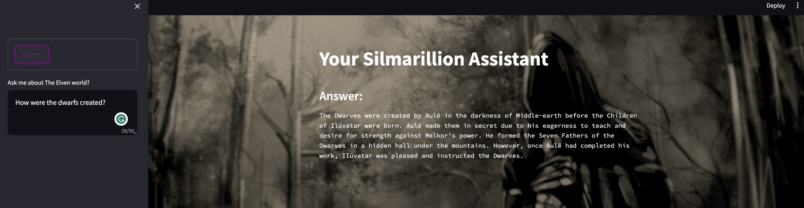

## The Silmarillion personal assistant local version

I have been a avid follower of the Silmarillion for a long time. I have read the book many times and I have always wanted to create a personal assistant that would be able to answer questions about the Silmarillion. I have finally decided to do it. 
J.R.R. Tolkien is one of my favorite authors and I have always wanted to do something to honor his work. I hope that this project will be a good start.



## How to use it
1. Step 1: Download Ollama
    ```bash
    #For mac users:
    brew install ollama
    #For Linux users:
    curl https://ollama.ai/install.sh | sh
    ```

2. Step 2: Dowload the model

    For this project I have used Mistral. You can download it by using using the following command
    ```bash
    ollama run mistral
    ```
3. Step 3: Clone the repository
    ```bash
    git clone

4. Step 4: create a virtual environment
    ```bash
    python3 -m venv venv
    source venv/bin/activate
    ```
5. Step 5: Install the requirements
    ```bash
    pip install -r requirements.txt
    ```
6. Step 6: 
    * To run using jupyter
        start your jupyter notebook
        ```bash
        jupyter notebook
        ```
        Open the notebook and run the cells

    * To run using UI
        ```bash
        streamlit run app.py
        ```

   
